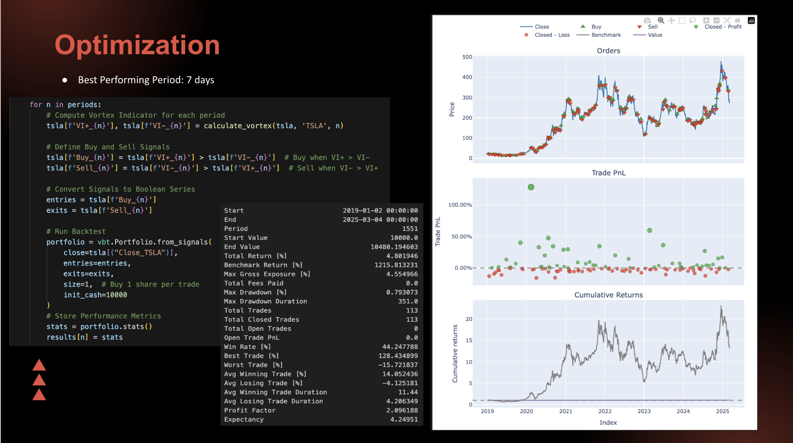
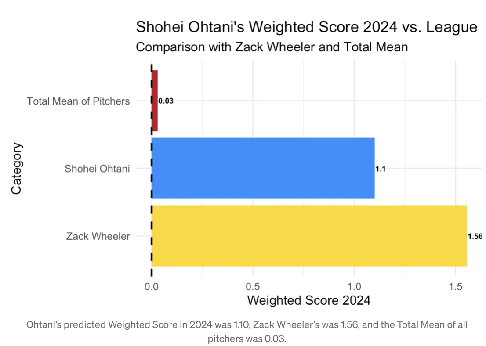

<!-- Finance Strategy Project -->

  
  <h3>Sentiment-Driven Trading Strategy</h3>
  
Developed a custom strategy using the Vortex Indicator, 5-day average sentiment overlays, and ATR filtering. Backtested using VectorBT across multiple tickers like TSLA, SPY, and AAPL.

  <a href="https://github.com/pranjul11garg/Vortex-Sentiment-Adaptive-Volatility-VSAV-Strategy.git" target="_blank">View on GitHub</a>

<!-- Shohei Ohtani Data Project -->

  
  <h3>Shohei Ohtani: Performance Breakdown</h3>
  
Analyzed Ohtani’s predicted pitching stats for the 2024 season using R and visualizations. This project supported an article exploring what makes him such a unique asset in baseball.

  <a href="https://github.com/marcopgus/ohtani-2024-prediction.git" target="_blank">View on GitHub</a> 
  <a href="https://medium.com/@marcopg/shohei-ohtanis-2024-pitching-what-if-f7c80b87ad2d" target="_blank">Read the Article</a>

